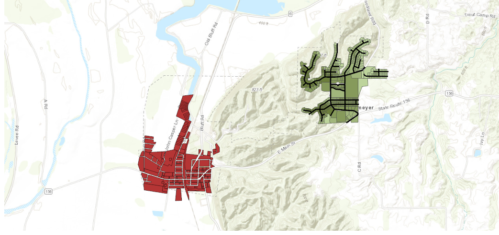

# Flood Relocation & Terrain Suitability Analysis – Valmeyer, IL
## Project Objective

Evaluate terrain suitability and relocation feasibility for a flood-impacted community using spatial analysis and raster modeling.

## Data Sources

USGS Digital Elevation Model (DEM)

Parcel boundary datasets

Road network shapefiles

Historical flood zone data

## Tools Used

ArcGIS Pro • Spatial Analyst • Zonal Statistics • Raster Distance • ArcGIS Online

## Methodology

Derived slope and elevation rasters from DEM

Conducted zonal statistics to evaluate terrain conditions

Calculated mean relocation distances using raster distance tools

Integrated parcel and infrastructure data to assess accessibility

Developed comparative maps of original vs relocated parcels

## Key Findings

Identified terrain-constrained areas unsuitable for redevelopment

Highlighted zones with favorable slope and accessibility

Demonstrated GIS’s role in supporting post-disaster planning decisions

## Outputs

