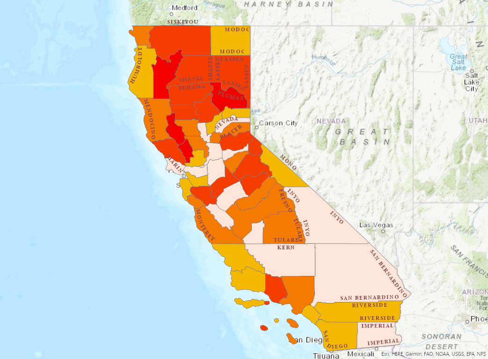

# 🔥 Wildfire Impact & Land Exposure Analysis – California
## Problem Statement

Wildfires cause large-scale environmental and infrastructure damage, requiring spatial analysis to understand the geographic extent of impact. This project evaluates wildfire-affected land areas at the county level to demonstrate how GIS supports regional risk assessment and planning.

## Project Objective

Quantify wildfire exposure by county using spatial overlay and attribute analysis to identify regions with higher levels of land impact.

## Data Sources

CAL FIRE wildfire perimeter datasets

California county boundary shapefiles

Land area and attribute data

## Tools Used

ArcGIS Pro • Spatial Overlay • Attribute Joins • Field Calculations • Cartographic Layout Design • ArcGIS Online

## Spatial Analysis Workflow

Imported and cleaned wildfire perimeter datasets

Performed spatial overlay between wildfire boundaries and county polygons

Calculated total burned area and percentage of land affected per county

Conducted attribute joins to integrate spatial results with tabular data

Designed choropleth maps to visualize wildfire impact intensity

Published interactive web maps via ArcGIS Online

## Key Findings

Identified counties with the highest proportional wildfire land impact

Revealed regional variations in wildfire exposure across California

Demonstrated how GIS supports evidence-based risk assessment and resource planning

## Outputs

